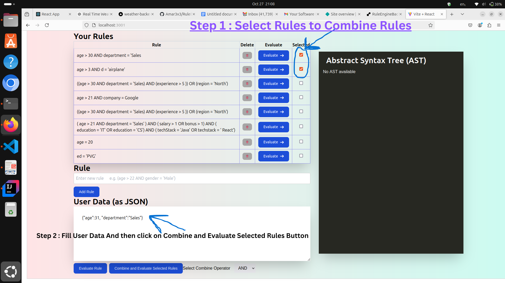

# Rule Engine Project

This project consists of a backend developed using Spring Boot and a frontend built with React. The backend runs on `localhost:8080`, and the frontend runs on `localhost:3001`. The application connects to an online MongoDB cluster for data storage.

## Prerequisites

- **Java 17 or higher**
- **Node.js and npm** (Node Package Manager)

## Getting Started

### Backend Setup (Spring Boot)
0. ## You can also pull docker image for backend if you dont to install springboot maven dependencies
   ```bash
   docker pull amar3x3/amar:ruleenginebackend

2. **Navigate to the Backend Directory**:
   ```bash
   cd ./RuleEngineBackend

3. **Build the Backend (optional): If you have Maven installed, you can build the project:**
   ```bash
   mvn clean install
4. **Database is already montitored in Mongodb atlas serveless cluster so you dont need to install it**

5. **Run the Backend: Start the Spring Boot application using the following command:**
   ```bash
   ./mvnw spring-boot:run

## The backend should now be running on http://localhost:8080.


# Frontend Setup (React)
1. **Navigate to the Frontend Directory:**
   ```bash
   cd ./RuleEngineFrontEnd

2. **Install Dependencies: Make sure to install all necessary dependencies:**
   ```bash
   npm install

3. **Create the .env File: Create a .env file in the RuleEngineFrontEnd directory and add the following line**
   ```bash
   VITE_BACKEND_URL=http://localhost:8080

4. **Run the Frontend: Start the React application using the following command:**
   ```bash
   npm run dev

## The frontend should now be running on http://localhost:3001



